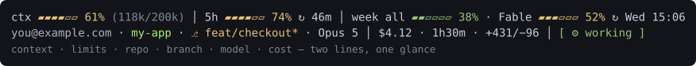
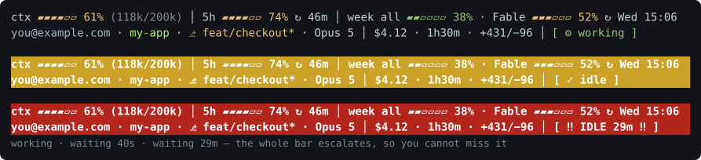
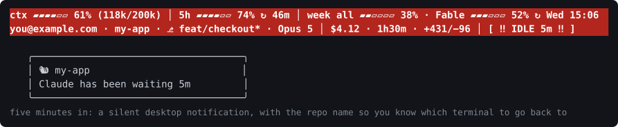
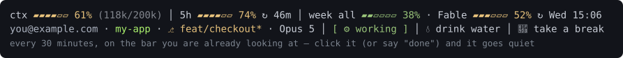
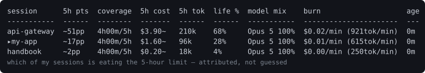
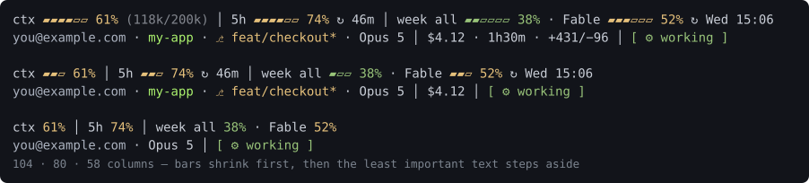
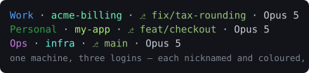

<div align="center">

# 🐿️ Squirrel

**A Claude Code status line for ADHD brains.**

It tells you when to look up. Context, usage limits, git state, which session is burning
your 5-hour limit — and an alarm you cannot miss when Claude is waiting on *you*.

**Every part of it is yours to change — by asking.** Colours, thresholds, what's on the bar
and in what order, new segments, reminders, alerts. You never open a config file: you say
*"warn me sooner"* or *"drop the cost"* and Claude does it.
[How that works ↓](#just-tell-claude-what-you-want)

</div>

```
/plugin marketplace add kubalajiri/claude-squirrel
/plugin install squirrel@squirrel
/squirrel-setup
```



---

## The problem

You start Claude on something, switch to Slack, and come back **eleven minutes** after it
finished. Or you hit the 5-hour limit at 3pm with no idea which of your four open sessions
spent it. Or you look up and it's 6pm and you haven't had a glass of water.

Squirrel puts all of that in the two lines you are already staring at.

## Why it works this way

Built by an ADHD developer, around the things that actually go wrong — not around a
feature list:

| What happens | What Squirrel does about it |
|---|---|
| You switch away while Claude works, and the thread is gone | the **whole bar** escalates — amber, then red, with the wait counting up. Peripheral vision catches it; a small chip doesn't |
| Notifications get dismissed before they're read | it isn't a notification. It's on the line already in front of you, and it stays until you deal with it |
| Time blindness — *how long have I been on this?* | wait time, session length and every reset are on screen as numbers, always |
| Hyperfocus eats the water, the food, the break | reminders live **on the bar**; one click and they're quiet for another half hour |
| "Check the usage panel" is a task you won't do | the limits are already there. No command, no context switch |
| Configuring things is a task you *really* won't do | you never edit a file — tell Claude in plain words and it does it |
| Four sessions open, no idea which one spent the limit | it attributes the usage per session, and says `?` rather than guess |

**No sound. No pop-ups. Nothing steals focus.** Every colour, threshold and segment can be
changed or switched off, so it can be as loud or as quiet as your senses want it.

## Claude is waiting on you → the bar turns amber, then red



Working is quiet. After 30 seconds of waiting the bar turns amber. After two minutes it goes
red with a loud chip: `[ ‼ IDLE 29m ‼ ]`. Every threshold and colour is yours to change, and
you can add as many steps as you like.

## When you're on another monitor



Three screens means the loudest bar in the world is still invisible half the time. So the
ladder keeps going: at five minutes Squirrel sends a **desktop notification** with the repo
name in it, so you know which terminal to go back to. **No sound** — and it stays quiet while
that terminal is the window you're actually looking at.

Every step is a phase you can move, change or delete, and a phase can run *anything*:

```
"notify me after 2 minutes instead of 5"
"send it to my phone as well"        →  run="curl -d ... ntfy.sh/your-topic"
```

## 💧 Drink water



The reminder that actually works, because it is **on the thing you are already looking at** —
not a notification you dismiss without reading. Click it (in VS Code or Cursor), or just tell
Claude you drank it, and it goes quiet for another 30 minutes.

```
"remind me to drink water every 30 minutes"
"remind me to stand up every hour, but only after 9am"
```

Any reminder you can describe, on your schedule, acknowledged by a click.

## Which session is eating my limit?



Run several Claude sessions at once and the 5-hour limit is shared, but nothing tells you
*whose*. Squirrel attributes it from Claude's own usage numbers — `~` when a stretch was
shared between sessions, `?` when it genuinely cannot know. It never invents a figure to look
confident.

## Responsive



Narrow the pane and the bars shrink first, then the least important text steps aside. The
numbers are the last thing to go.

## If you already juggle several accounts

Claude Code is what lets you run more than one login (a separate `CLAUDE_CONFIG_DIR` or `HOME`
per account) — Squirrel doesn't set that up. What it does is make them **tellable apart at a
glance**, so you stop typing into the wrong one:



- **Nickname any account** — `you@company.com` becomes `Work`, so you can tell at a glance
  which login this session is on
- **Give each one a colour** — and each repo too, if you want
- **Settings follow you** — configure once and every profile on the machine picks it up, or
  keep a setting to one profile with `--here`
- **Limits stay separate** — usage, attribution and reminders are tracked per account, never
  pooled across logins

Never done it? It's two aliases — each config dir gets its own login and its own limits:

```sh
alias claude-work="CLAUDE_CONFIG_DIR=~/.claude-work claude"
alias claude-me="CLAUDE_CONFIG_DIR=~/.claude-me   claude"
```

The first run in each asks you to log in. After that, tell Squirrel who's who:

```
"call this account Work and make it blue"
"the infra repo should be orange"
```

---

## Just tell Claude what you want

Squirrel ships a skill, so **Claude knows how to configure all of it** — you never edit a
config file:

| Say this | What happens |
|---|---|
| *"make the idle alarm go off after 1 minute"* | `alarmAfterSeconds` → 60 |
| *"I don't need the cost on my status line"* | the `cost` segment is switched off |
| *"put the branch first and drop the PR number"* | your layout is rewritten, surgically |
| *"colour my work account blue"* | per-account colours |
| *"remind me to drink water every half hour"* | a clickable reminder segment |
| *"which session is using my limit?"* | the attribution table |
| *"why is my bar showing 43%?"* | it can explain its own numbers |

Every setting is also a slash command (`/squirrel-set`, `/squirrel-layout`,
`/squirrel-phases`, `/squirrel-sessions`, …) if you prefer typing.

## Also in the box

- **Usage limits** — 5-hour, weekly, and per-model buckets, with reset countdowns
- **Cross-session attribution** — `mine 43pp/77%`: what this session put on the shared limit
- **Desktop notifications** — a silent toast when the bar isn't the screen you're on; Windows/WSL, Linux and macOS
- **Watcher tasks** — "if I've been idle 30 minutes, nudge me"; scriptable, with a hard ceiling
- **Custom segments** — any command's output, on a schedule, styled and placed where you want
- **Bar rules** — paint the whole bar when a condition holds (`when=weekly.pct > 85`)
- **No pricing tables, no scraping** — only numbers Claude Code hands over for free
- **One render, no daemon** — the status line is its own heartbeat; nothing runs in the background

## Documentation

**[Full documentation →](plugin/README.md)** — every segment, every config key, all the slash
commands, how the numbers are derived, and the security notes.

**[Contributing →](CONTRIBUTING.md)** — how to send a change, the repository layout, the test
suite, and the conventions that keep it honest.

**[Security →](SECURITY.md)** — what Squirrel promises about your data, and how to report a
problem privately.

## Licence

MIT — see [LICENSE](LICENSE).
